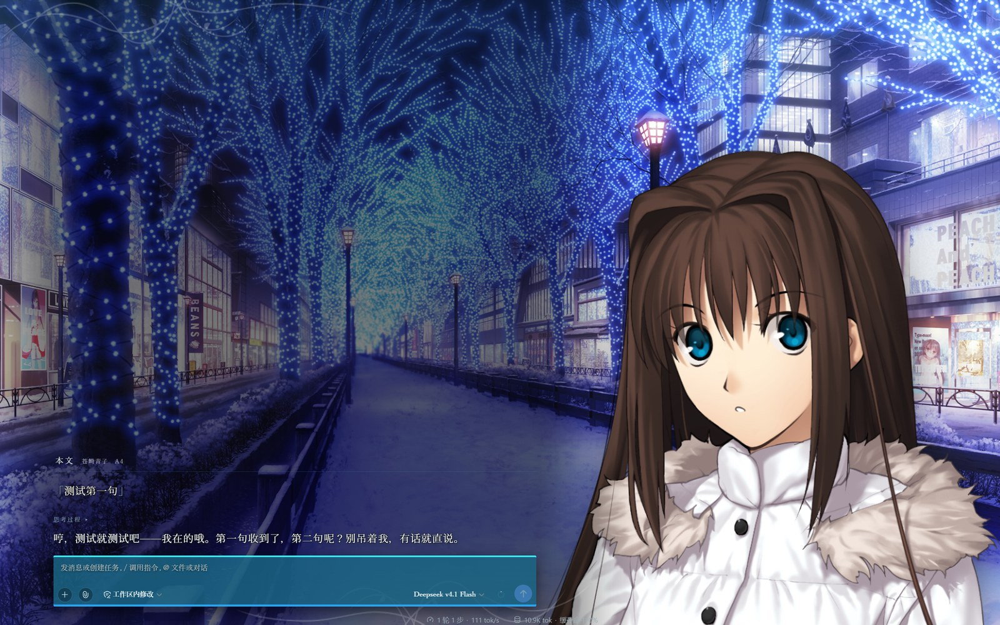
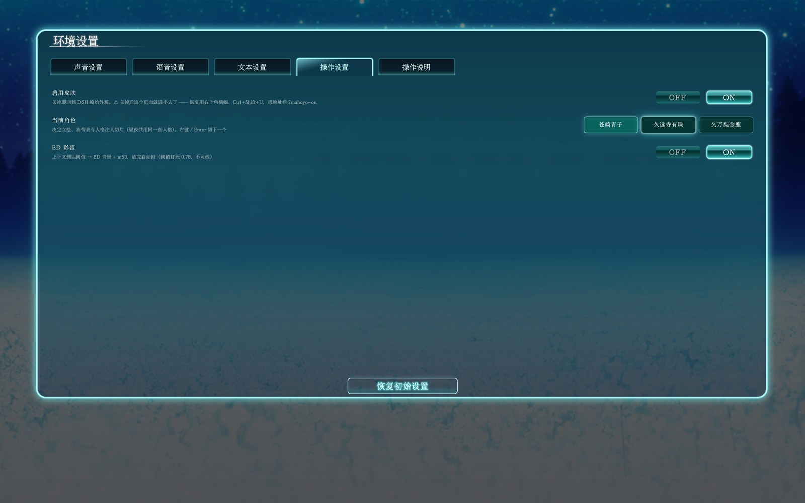
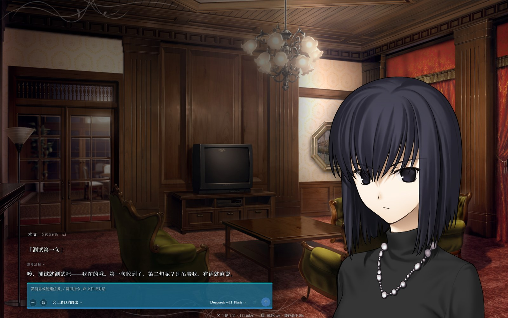
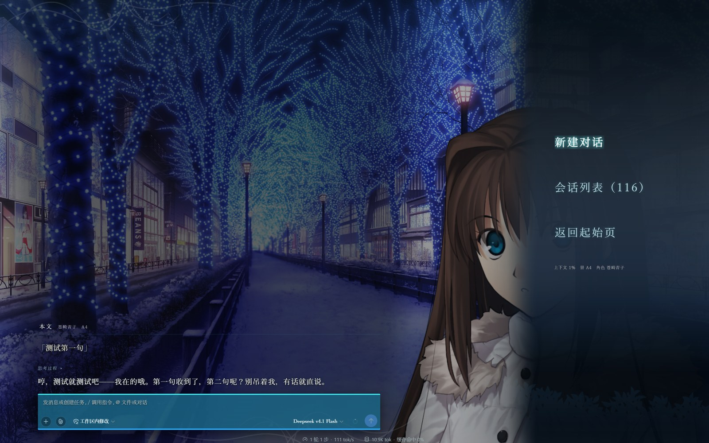

# dsh-skin-mahoyo · 《魔法使之夜》DSH 主题皮肤

> **Witch on the Holy Night / Mahoutsukai no Yoru（魔法使いの夜）** 主题，
> 做给 **DeepSeek Harness（DSH）** Web UI 的整屏皮肤插件（theme / skin）。
>
> 挂上之后，DSH 不再是聊天框，而是一屏视觉小说。满屏场景、角落立绘、
> 能点能选的原作式菜单。白天黑夜两套完全不同的景与曲。聊到某一步会放片尾。
>
> 三个角色（苍崎青子 / 久远寺有珠 / 久万梨金鹿）各有立绘、表情与人格 skill。

[](LICENSE)
[](https://github.com/deepseek-ai/deepseek-harness)
[](#9-技术)
[](https://github.com/topics/dsh-plugin)



---

## 目录

**第一部分 · 它能干什么**
- [1. 这不只是个配色](#1-这不只是个配色)
- [2. 界面预览](#2-界面预览)
- [3. 三个人，两套昼夜](#3-三个人两套昼夜)
- [4. 她为什么会在你打字的时候换表情](#4-她为什么会在你打字的时候换表情)
- [5. 三个人格 skill：做了，但没做完](#5-三个人格-skill做了但没做完)
- [6. 换一首曲子，别从头开始](#6-换一首曲子别从头开始)
- [7. 片尾](#7-片尾)
- [8. 怎么点](#8-怎么点)

**第二部分 · 如果你非要动它**
- [9. 技术](#9-技术)
- [10. 装上](#10-装上)
- [11. 原作素材怎么来](#11-原作素材怎么来)

**第三部分 · 其它的**
- [12. 关于「情感推近」](#12-关于情感推近)
- [13. 这套能不能搬去别的 GalGame](#13-这套能不能搬去别的-galgame)
- [14. 致谢](#14-致谢)
- [15. 版权](#15-版权)

---

# 第一部分 · 它能干什么

## 1. 这不只是个配色

市面上的 DSH 皮肤，绝大多数干的是**换配色** —— 挑一套好看的 CSS 变量，
界面结构还是 DSH 那套。

这个不是。它把 DSH 的对话界面**整个换成了一部视觉小说的画面**：背景铺满，
立绘站角落，底部一条原作风格的对话框，菜单是原作那种一格一格的形态。
DSH 原本的侧栏、右栏、页签条、消息列表**全部让位**，正文由皮肤自己重画一遍。

代价是它要接管整屏，所以它必须能一键关掉。见 [§10 逃生门](#逃生门重要)。

## 2. 界面预览

**起始页** —— 进 DSH 的第一屏


**环境设置** —— 按原著的五横页签重做



**换一个人** —— 苍崎青子 → 久远寺有珠：景、立绘、人格全换。



**会话菜单** —— 点画面空白处呼出



## 3. 三个人，两套昼夜

| 谁 | 白天 | 晚上 |
|---|---|---|
| **苍崎青子** | 教室 | 夜·灯饰通学路 |
| **久远寺有珠** | 洋房客厅·白天 | 洋房客厅·夜晚 |
| **久万梨金鹿** | 公园步道·秋 | 洋馆客室·夜 |

切换入口有三个：皮肤菜单里选、打 `/mahoyo-character`、或者直接改
`$DSH_HOME/settings.yaml` 里的 `moye-skin.character`。

**昼夜不读时钟。** 它跟着你的 DSH 主题走 —— 你把界面调暗，她就到晚上去了。
不需要真的等到天黑。

> 换角色是**一整套**换：立绘、表情表、人格注入、BGM 全跟着走。
> 明暗则只决定景和曲。这两件事互不干扰 —— 你可以白天用有珠，晚上还用有珠。

## 4. 她为什么会在你打字的时候换表情

她的**台词文本**会被实时读一遍，认出情绪，然后换脸。一共 12 种：

```
累了 · 难过 · 生气 · 苦恼 · 认真 · 吃惊
微笑 · 害羞 · 瞪 · 思考 · 面无表情 · 大笑
```

关键在于：**三个人各有各的词典。** 除了通用的那套，
每个人还带一批**只有她会说**的话，各自挂到不同情绪上。

比如「算了，就这样吧」「哼，还行」是**青子专属**的「微笑」词条；
有珠那边对应位置是「……还行」「嗯，可以」；金鹿则是「算你有点用」「还不错嘛」。
同样一句让步的话，从三个人嘴里说出来，本身就不是同一种语气。

而且它**不是每句话都换脸**。一次回复最多换一次，回落的时候要连着两句才认。
同一个表情连着挂三句以上，会悄悄换一帧 —— 免得她像张纸片贴在那儿。

> 原作没给某件衣服画某个表情，就**回退**到相近的那张，**不自己画图补**。
> 所以有珠的景里连「微笑」都没有独立差分 —— 她那个人本来就很少笑。

## 5. 三个人格 skill：做了，但没做完

表情管的是她**长什么样**，人格管的是她**怎么说话**。

三个角色各有一套人格 skill，在 [`personas/`](personas/) 下。做法是**通读原著全文**
（24,134 行日文剧本），逐条挂行号、逐条标证据强度：

| 角色 | 证据条数 | 注入切片 |
|---|---|---|
| 苍崎青子 | 170 条 | 1187 字 |
| 久远寺有珠 | 145 条 | 1529 字 |
| 久万梨金鹿 | 139 条 | 1190 字 |

读到的东西按 **17 个维度**整理（性格内核、动机、价值观、决策方式、压力反应、
人际关系、说话风格、矛盾与阴影……），每条结论都标了分级：

| 级别 | 含义 |
|---|---|
| `L1` | 支撑该结论的独立记录 ≥8 条 |
| `L2` | 3–7 条 |
| `L3` | 1–2 条，单点推断 |
| `L4` | 归属或解释有歧义，**明写「待验证」，不参与立论** |

给角色的**台词**定规矩时也做了同样的分级 —— 哪些语尾是她的、哪些是别人的，
都得回到原文行号。举个已经查实的例子：有珠的语尾里 `〜ですわ` **全篇 0 例**，
`〜ですこと` 唯一那一例还是青子在挖苦她。这种事不查就会写错，而且写错了没人看得出来。

### 但这套东西还不完美

**欢迎任何人继续优化。** 以下是已知的短板，都是可以下手的地方：

- **金鹿的证据最薄** —— 139 条里 L2 占了 61 条，L3 还有 9 条。
  她的档案里凡主要依赖番外篇的维度，都标了「不要当作正篇的常态性格使用」。
- **共同的缺口**：原作没写的地方就是没写。有些维度只能靠少量场景推断，
  这些**一律标了「待验证」而不是硬猜**。你要是读过原著、觉得某条推得不对，
  那就是最有价值的反馈。
- **一个已经踩过的坑值得知道**：有珠被**写窄过两次** ——
  第一次把「面无表情」推成了「话少」，第二次把她的「分寸」推成了「乖」
  （写出「我会安静」「我等你」这种她根本不会说的话）。
  根因是把"素材少"当成了"人简单"。现在约束写进了 `constitution.md` 的红线：
  **面无表情 ≠ 话少；她绝不迁就。**
- **翻译层面**：日文语尾（`〜わよ`／`〜のよ`）映射成中文的说法是人为定的。
  现在的对照表在 `skin/tools/persona-emotions.mjs` 里，可以改。

想改的话，运行时读的是 `skin/data/personas/*.md`
（**不是** `personas/*-skill/soul/injection.md`，后者是 skill 包那份，是前者的子集），
改完刷新页面即可生效，不用重启。

## 6. 换一首曲子，别从头开始

白天 8 首、晚上 5 首，表紙另有 2 首，加上片尾 1 首，一共 **16 首**，全部取自原著。

**而且它记得播到哪儿了。** 原本切个角色、回一趟起始页，音乐就从头再来一遍；
现在播放位置会被记下来，切回来**从断掉的那一秒接着放**。

连"离结尾只剩两秒"这种边界也处理了（不然一进去就跳下一首），
以及"网络慢、曲子还没加载完就想跳到第 90 秒"（会被浏览器静默忽略）——
所以它得等到能跳的时候才跳。

**第一次点界面之前不会有声音。** 这是浏览器的规矩，不是皮肤装死。

## 7. 片尾

聊到某个时候，画面会**忽然暗下去，开始放片尾曲**。

没有进度条，也没有"是否观看"的询问 —— 就是这一屏演完了，该出字了。

背景缓缓上移，字幕从下方滚过：先是大标题《魔法使之夜》，
然后是「这个故事，不属于任何人」，接着署名原作的三位 —— 剧本奈须蘑菇、
原画小山广和、音乐 KATE、发行 TYPE-MOON。

再往下是皮肤自己那一行，标着「非官方」。
放在原作署名之后，是因为它本来就不该排在前面。

最后一句是「**夜，还没有亮。**」

放完自动返回。不想看完就点左下角的「跳过」。

> **每个会话只演一次。** 想看第二遍，开个新会话。
>
> 触发点卡在上下文用量 **78%**，写死的。它离 DSH 自己的压缩线（80%）只有 2 个点 ——
> 所以**有时候你就是看不到**，因为用量可能一步就跨过这个窗口了。
>
> 这是刻意的取舍：定得太高永远到不了，定得太低就是跟压缩抢时间。

## 8. 怎么点

**先说清楚：这套操作是照抄原著的，所以它并不好用。**

《魔法使之夜》是视觉小说，剧情是躺着看的，玩家的主要动作是「翻页」和「退出」。
所以原作把**左键做成了后退**，确认靠回车。这跟现代界面的习惯是拧着的 ——
在现代 UI 里左键点一下就该是"确认"，在这里不是。

| 你做什么 | 会发生什么 |
|---|---|
| 点画面空白处 | 唤出 / 收起菜单 |
| **左键点菜单项** | **往后退一层**（子菜单 → 主列表 → 关闭） |
| **`Enter` / 右键** | **确认进入** |
| `↑` `↓` | 移动焦点 |
| `Esc` | 也是往后退 |

记不住就记一句：**想进去按回车，左键永远往回走。**

> 这是有意为之。原作就这么点的，改了就不像原作了。
>
> 实在受不了的话，改 `client.js` 里 `onMouseDown` 的分支就行，只有那一处。

---

# 第二部分 · 如果你非要动它

## 9. 技术

<details open>
<summary><b>没有构建步骤</b></summary>

```
skin/lib/client.js    8224 行，手写的 __ModuleLoader__ bundle
skin/lib/index.js      648 行，Node 宿主半边
```

**不跑 tsdown / esbuild / pnpm install。** `client.js` 就是最终产物，改完直接刷新浏览器。

原因是 DSH **冻结了种子模块**：外壳只播种 9 个静态模块，本包只用到其中 3 个
（`react` / `react/jsx-runtime` / `react-dom/client`）。换句话说 —— **引不了任何库**。

所以正文的 Markdown 渲染器、立绘交叉淡入状态机、BGM 断点续播，全是手写的。
有个断言守着这条约束：

```
✓ 只 require 种子模块
```

> 顺带一个坑：外壳那个 `jsx` 函数只接受两个参数，**变长 children 会被静默丢弃** ——
> 不报错、不警告，元素照建，里面永远是空的。所以必须用 `React.createElement`。
>
> 临床表现是"容器渲染出来了、尺寸也对、内容是空的"，
> 看起来像 CSS 问题、像数据问题、像 React 版本问题。都不是。
</details>

<details>
<summary><b>两个半边</b></summary>

| | 宿主半边 | 浏览器半边 |
|---|---|---|
| 文件 | `lib/index.js` | `lib/client.js` |
| 跑在 | Node（DSH 进程内） | 浏览器 |
| 干什么 | 素材静态路由 · 设置持久化 · 人格注入 | 整屏 UI |
| 改完要 | **重启 DSH** | **只刷新页面** |

宿主半边**刻意做得很怂**：`apply()` 整体 try/catch，三个子系统各自再 try/catch，
设置用宽松 schema + 代码内白名单归一化。目标是**只可能"少干活"，不可能把 DSH 弄挂**。
</details>

<details>
<summary><b>三个不要碰的坑</b></summary>

| 别做 | 为什么 |
|---|---|
| ❌ 注册进 `root` 槽 | 它是 **single 槽**，第二个注册者会**顶掉整个 AppFrame** |
| ❌ 注册进 `shell.overlay` | 那个槽上**任何一次** render 抛错，DSH 的 `SlotErrorBoundary` 会**永久**把整个槽变成崩溃占位 —— **逃生门和被救的对象一起死** |
| ❌ 覆写 DSH 的哈希类名 | 那是 CSS Modules 哈希（`mufS8W_card`），DSH 升级一次全变。换肤走 `--dsw-*` token |

所以皮肤根是**自建容器挂在 `document.body`**（`#myh-skin-root`），
跟 DSH 的插槽系统完全解耦 —— 皮肤崩了只影响皮肤。
</details>

<details>
<summary><b>离线自检：282 项断言</b></summary>

不需要 DSH、不需要浏览器，纯 Node 跑：

```bash
node skin/tools/check-client.mjs      # 主体 282 项
node skin/tools/check-hooks.mjs       # hooks 规则扫描
node skin/tools/audit-render.mjs      # 渲染守卫链
node skin/tools/lint-identifiers.mjs  # 裸标识符扫描
```

其中**两个脚本专门查同一件事**（**React #310**：hook 必须排在所有 `return` 之前，
否则运行时报 "Rendered fewer hooks than expected"）。这两个扫描器**刻意不合并**。

因为第一个版本撒过谎。它把"嵌套函数降噪"的判据写成"前面有 `(` 或 `=>`"，
结果 `function Component(props) {` 里那个 `(` 让**组件自己的身体**被误判成嵌套函数，
**整批 hook 被静默丢掉** —— 然后扫描器报告说"通过"。

> **教训：凡是"检查工具说通过、但现象依旧"，先怀疑工具本身在撒谎。**

另一个相关坑：`enabled` 在 `false ↔ true` 之间必须**过界一次**才测得出来 ——
同状态连渲三次抓不到 #310。
</details>

<details>
<summary><b>诊断口与逃生门</b></summary>

皮肤是自建容器铺满整屏的，出问题时你得能关掉它：

| 操作 | 效果 |
|---|---|
| `Ctrl+Shift+M` | **就地关闭皮肤**（不用重启） |
| `Ctrl+Shift+U` | 恢复皮肤 |
| 地址栏 `?mahoyo=off` / `?mahoyo=on` | 强制关 / 强制开 |

关闭后右下角**会一直挂着一条横幅**告诉你恢复方法 —— 因为那个关闭标记写在
localStorage 里、**一旦写下每次刷新都生效**。一个只能关不能开的开关本身就是故障源，
不提示的话就只能重装 DSH 了。

`/moye-skin/health` 可以看皮肤自己的运行状况，不需要开控制台、不需要截图、
不需要跟任何人复述现象：

```powershell
(Invoke-WebRequest http://127.0.0.1:3080/moye-skin/health -UseBasicParsing).Content |
  ConvertFrom-Json | Select-Object -ExpandProperty diag
```

里面能看出 bundle 到底跑没跑、跑的是哪一份代码、DOM 采了什么、
hooks 有没有出界、以及任何客户端报错（带 componentStack）。
</details>

<details>
<summary><b>设置项全表</b></summary>

设置页是按原著的**五横页签**做的：声音 / 语音 / 文本 / 操作 / 操作说明。
所有值写进 `$DSH_HOME/settings.yaml` 的 `moye-skin` 段。

| 页签 | 设置 | 默认 | 作用 |
|---|---|---|---|
| 声音 | 背景音乐 | 开 | BGM 开关 |
| 声音 | 音量 | 35% | **五档方块**（0/25/50/75/100%），做成原著那种五格样式 |
| 声音 | 界面音效 | 开 | 素材缺失时静默降级，不报错 |
| 语音 | 人格注入 | 开 | 每轮注入当前角色的人格切片 |
| 文本 | 立绘 | 开 | 显示 / 隐藏立绘 |
| 文本 | 对话框 | 开 | 底部对话框 + 打字机 |
| 文本 | 隐藏页签条 | 开 | 隐藏失败会自动降级成细条 |
| 文本 | 进入时收起工具栏 | 开 | **只做一次有保护的收起**，之后不跟你对着干 |
| 操作 | 启用皮肤 | 开 | 关掉即回到 DSH 原始外观 |
| 操作 | 当前角色 | 青子 | 切角色 |
| 操作 | ED 彩蛋 | 开 | 开关片尾 |

页脚有「恢复初始设置」。

另外有三个**只在 YAML 里、面板上没有入口**的项：`sfxVolume`（音效音量）、
`assetRoot`（素材根目录，留空＝用包内 `assets/`）、以及 `edThreshold` ——
最后这个是**已废弃的僵尸值，代码刻意不读它**（片尾阈值钉死在 0.78）。
</details>

<details>
<summary><b>人格注入是怎么回事</b></summary>

每个模型回合，当前角色的人格切片会注入系统提示词。
切片**怎么做的、短板在哪、怎么参与改进** —— 见 [§5 三个人格 skill](#5-三个人格-skill做了但没做完)。
这里只说**接进来之后**的部分。

> **人格可以单独关掉**（设置里的「人格注入」开关）。关掉后立绘表情照常，只是不再注入。
>
> 注入段的内部名字**固定不变**（`skin:mahoyo:persona`），切角色只改它读到的值 ——
> 所以旧人格**永远不会残留**。这是刻意设计，别改成动态名字。
>
> ⚠️ 运行时读的是 `skin/data/personas/*.md`，**不是** `personas/*-skill/soul/injection.md`。
> 后者是 skill 包那份，前者多两段（语言硬约束 + 情感表达约定）。
> **改人格要改前者** —— 改后者，皮肤不会有任何反应。
>
> 切片按 mtime 缓存失效，改完**不用重启 DSH**，刷新页面即可。
</details>

## 10. 装上

需要 **DSH ≥ 0.1.5-rc.1**。

```bash
node skin/tools/check-client.mjs     # 离线自检：282 项断言
pwsh -File skin/tools/install.ps1    # 装进 $DSH_HOME/profiles/web/node_modules/
```

然后**重启 DSH**，刷新浏览器页面。

> - 改 `lib/client.js` → 只需刷新页面
> - 改 `lib/index.js` 或包配置 → 需要重启 DSH
> - `install.ps1` 也支持 `-Uninstall` / `-Enable` / `-Disable` / `-SafeBoot`

### 逃生门（重要）

皮肤接管整屏，所以你**必须**知道怎么关掉它。三条路：

`Ctrl+Shift+M` 就地关闭 · `Ctrl+Shift+U` 恢复 · 地址栏加 `?mahoyo=off`

还有一层保险：**安全模式**。在包根目录建一个叫 `SAFE_MODE` 的文件
（或设环境变量 `MAHOYO_SAFE=1`），皮肤会完全不注册 —— 这样即使 DSH 已经起不来、
或者你连浏览器都进不去，也有一条不需要改 YAML 的退路。

```powershell
pwsh -File skin\tools\guard.ps1 -PreflightOnly   # 只预检，不动任何东西
pwsh -File skin\tools\guard.ps1 -SafeBoot        # 预检后建 SAFE_MODE
pwsh -File skin\tools\guard.ps1 -NormalBoot      # 删掉 SAFE_MODE
```

## 11. 原作素材怎么来

**本仓库不含素材。** 要把它填满，可以自己去网上获取原著资源。完整步骤在
**[`skin/ASSET-RECOVERY.md`](skin/ASSET-RECOVERY.md)**。交给你的Agent，它可以帮你解决。没办法，版权问题。

这里说个大概：

| 素材 | 数量 | 能不能从原著重建 |
|---|---|---|
| **音频**（BGM 16 + 音效 7） | 23 | ✅ **完全可靠**。`.hw` = 64 字节头 + 完整 OGG，切掉头就是合法 ogg |
| **图像**（立绘 136 + UI 208 + 背景 13） | 357 | ⚠️ **需要你先解包过原著**，或自己写 `.mzp` / `.cbg` 解码器 |

合计 **380 个文件 / 263.2 MiB**。

立绘和背景藏在原著私有的 `.mzp` / `.cbg` 格式里，仓库里那个解包工具的依赖
**在本项目中不存在**。所以文档分两条路：

- **路线 A** —— 你手上已经有解包好的 PNG（用别的工具解过）→ 直接裁剪接入
- **路线 B** —— 只有原著 → 需要自己补解码器，文档给出要改的地方和外部参照实现

两条路都会给你**逐文件的映射表**（哪一张对应原著的哪个归档）。

素材这块是整个项目最没技术含量的部分，纯粹是格式考古。
文档已经尽量写细了，但它没法替你解包。

### ⚠️ 透明层必须裁掉

原图自带透明外框。**不裁会坏**：皮肤用 `object-fit: cover` 铺满视口，
透明区也被算进缩放比例，结果是 ① 贴边黑缝（实测最宽 **451px**）② 画面被放大发糊。

而且**不能套统一规则** —— 右边的透明边从 0 到 451px 都有，两张壳景完全没有透明边。
用 [`skin/tools/crop_alpha.py`](skin/tools/crop_alpha.py) 自动按 alpha 边界裁，它是幂等的。

### ⛔ 两条禁令

1. **不要跑 `skin/tools/assemble-assets.mjs`** —— 它读的是旧立绘管线，会毁 `manifest.json`。
   脚本已加硬拦截（`exit 2`），**不要加 `--i-know-this-destroys-manifest` 绕过**。
   这个 flag 的名字不是修辞，是字面意思。
2. **不要在 `ui/` 上跑 `crop_alpha.py`** —— 那些构件的透明边是构图的一部分。
   该脚本默认只处理 `bg` 与 `sprite`。

---

# 第三部分 · 其它的

## 12. 关于「情感推近」

有些 DSH 皮肤带**情感推近**：按对话内容推进角色好感度 / 亲密度 / 关系阶段，
让角色随着交互变亲近。

**这个皮肤没有加，而且不打算加。**

**难道你配得上苍崎青子和久远寺有珠吗？**

本皮肤的做法是：**人格注入只管「她怎么说话」，不管「她对你多少分」。**
你跟她聊得好不好，从她的反应里自己看，没有仪表盘。

**真想推感情线？自己 fork 去，自己去搞，别在我面前玷污她们。**

fork 出去随便你怎么改，加好感度、加亲密度、加一百层情感状态机都行，
那跟我没关系了。但**别往上游 merge** —— 这个决定不是技术问题，不会改。

## 13. 这套能不能搬去别的 GalGame

**能，但不完全是开箱即用。** 这套架构是通用的，只是这一份填的是
《魔法使之夜》的内容。

**数据层**（换成别的作品主要改这里）：

| 绑定层 | 文件 | 要改什么 |
|---|---|---|
| 素材映射 | `skin/data/manifest.json` | 景 / 表情表 / 曲目 / UI 构件的路径表 |
| 人格 | `skin/data/personas/*.md` | 注入切片 |
| 素材本身 | `skin/assets/` | 换图换曲 |

**代码层**有几处硬编码，换作品时要跟着改：

```
client.js:88    SCENE_OF      角色 → 昼/夜景 的映射
client.js:110   SHELL_OF      角色 → 标题/设置页景 的映射
client.js:93    CHARACTERS    角色 slug 列表
client.js:94    CHARACTER_CN  角色中文名
index.js        CHARACTER_LABELS / 人格注入段
```

这几处都是"三个角色、每人一对昼夜景"的假设。如果你那部作品也是三个主角、
每人对昼夜两景，改起来就是改字符串；如果不是，得动一点结构。

其余部分 —— 表情分类器、BGM 记忆、菜单状态机、逃生门、自检套件 ——
是作品无关的。

换句话说：**这套东西真正在做的事，是把一部 GalGame 的"皮"接到一个 LLM 前端上。**
《魔法使之夜》只是第一张皮。

> 接下来有空可能会做**《月姬R》**（`月姫 -A piece of blue glass moon-`）。

## 14. 致谢

**DSH 生态**
- [deepseek-ai/deepseek-harness](https://github.com/deepseek-ai/deepseek-harness) —— DSH 本体
- [fendouai/awesome-deepseek-harness](https://github.com/fendouai/awesome-deepseek-harness) —— 插件索引
- [zhu1090093659/dsh-web](https://github.com/zhu1090093659/dsh-web) —— 插件与皮肤聚合

**GitHub 上所有开源的 DeepSeek 皮肤** —— 皮肤插件该怎么挂、token 该怎么覆写、
哪些边界不能碰，基本上是从这一堆项目里读出来的。尤其是那些把
「皮肤崩了怎么办」也认真处理过的项目，逃生门的设计受了很大影响。

**网站版老版《月姬》**
[**requinDr/tsukiweb-public**](https://github.com/requinDr/tsukiweb-public) ——
把 2000 年初版同人《月姬》搬到网页上，多语言、PWA、交互式流程图、多版本 BGM 切换。

**「把一部 GalGame 的操作逻辑原样搬进浏览器」这件事，它证明了是可行的。**
而且它同样**不随仓库分发原版素材**、让使用者自行准备资源 ——
本项目的版权处理方式参照了它。

**TYPE-MOON** —— 《魔法使之夜》

**参考的同类项目**
- [Ayase34/gal-view](https://github.com/Ayase34/gal-view) —— GalGame 式对话视图
- [wwwangzilin/dsh-character-presets](https://github.com/wwwangzilin/dsh-character-presets) —— 六层情感引擎（**本皮肤未采用**其机制，见 [§12](#12-关于情感推近)）

## 15. 版权

**本仓库不含任何原作素材。**

- 原作图像与音频的版权归 **TYPE-MOON** 所有
- 本仓库**不含**：立绘、背景、UI 构件、BGM、音效
- 本仓库**包含**：皮肤代码、工具链、人格文本、素材重建文档
- 人格文件**不批量保留原文台词** —— 最长引用为 30 字以内的短语式演出指示
- `skin/data/manifest.json` 里的词典只由短谓词构成

README 中的截图**仅用于展示界面结构**，其中的立绘与背景属于上述权利方，
**不随本仓库分发**（截图里能看到它们，是因为截图截自一份已接入素材的本地安装）。

**代码以 [MIT](LICENSE) 协议开源。**

> ⚠️ **DSH 目前是 developer preview**，官方 README 用全大写写着
> 「**THERE WILL BE COMPATIBILITY-BREAKING CHANGES**」。
>
> 皮肤挂在 DSH 的 Web UI 插件体系上，依赖它的插槽与属性（包括那个冻结的
> 9 个种子模块名单）—— **DSH 升级后皮肤可能失效**。

### 使用须知

- 请在你**合法拥有**原著的前提下接入素材
- 请勿将接入素材后的完整包二次分发
- 本项目与 TYPE-MOON 无任何关联，未获其授权或认可
